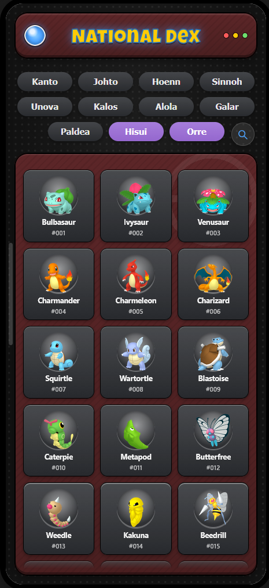

   

# What VKDex is;

A Pokédex app: plain HTML/CSS/JS (no framework) plus a Tauri shell packaging it as a portable Windows `.exe` and android apk.  

Design implementation & coding done by Claude.ai to try out Ai driven development.  
Also first time trying a proper git pipeline.

Currently, mobile front-end only, works on desktop.
Desktop front-end planned, not implemented.

Design & Data Sourcing & Structuring by @vokaerian-png
Code & Implementation by @Claude.AI

 

## Data & assets sources
[PokeAPI](https://github.com/pokeapi/pokeapi)  -  [PokeDB](https://pokedb.org/)

##

VKDex is not affiliated with, endorsed by, or sponsored by Nintendo, The Pokémon Company, GAME FREAK, Creatures Inc., or Niantic, Inc., and does not reflect the views or opinions of these companies or anyone officially involved in producing or managing Pokémon. Pokémon and all related titles, logos, characters, and distinctive likenesses are trademarks of and © Nintendo, Creatures, GAME FREAK, and The Pokémon Company. All game content and materials are copyrights of their respective owners.
